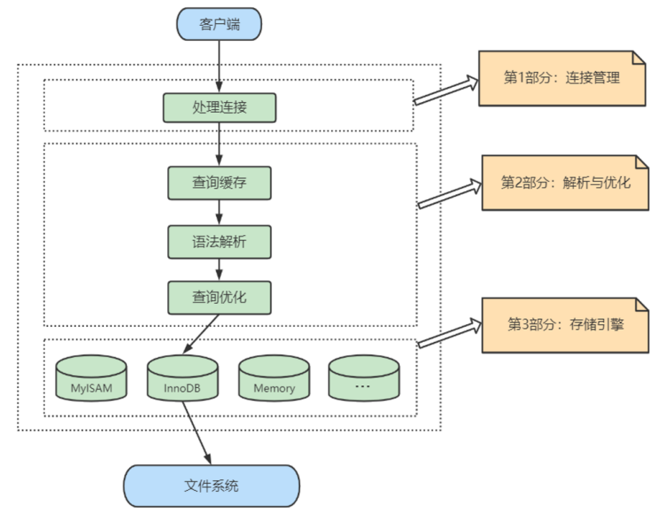
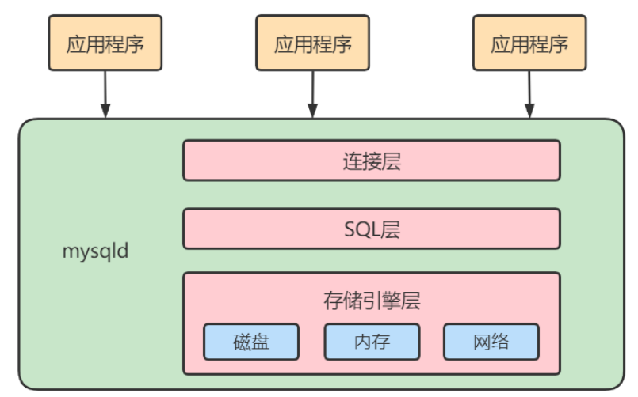
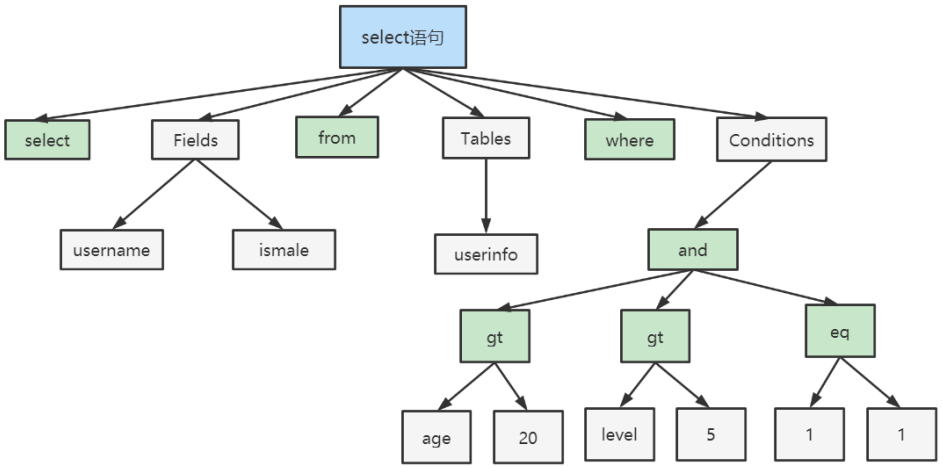
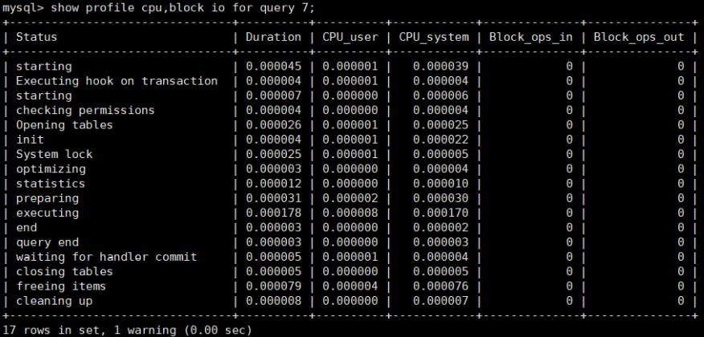
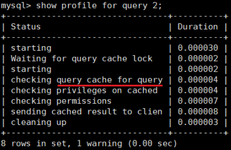
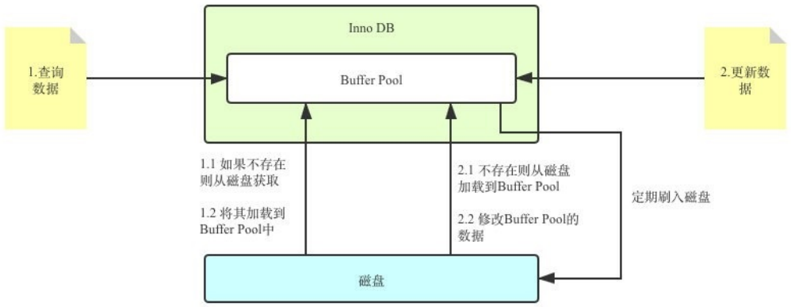
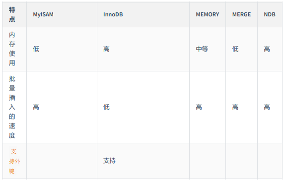

# 第04章_逻辑架构

## 1. 逻辑架构剖析

### 1.1 服务器处理客户端请求

首先MySQL是典型的C/S架构，即`Clinet/Server 架构`，服务端程序使用的mysqld。

不论客户端进程和服务器进程是采用哪种方式进行通信，最后实现的效果是：**客户端进程向服务器进程发送一段文本（SQL语句），服务器进程处理后再向客户端进程发送一段文本（处理结果）**。

那服务器进程对客户端进程发送的请求做了什么处理，才能产生最后的处理结果呢？这里以查询请求为 例展示：



下面具体展开如下：


### 1.2 Connectors

Connectors, 指的是不同语言中与SQL的交互。MySQL首先是一个网络程序，在TCP之上定义了自己的应用层协议。所以要使用MySQL，我们可以编写代码，跟MySQL Server `建立TCP连接`，之后按照其定义好的协议进行交互。或者比较方便的方法是调用SDK，比如Native C API、JDBC、PHP等各语言MySQL Connecotr,或者通过ODBC。但**通过SDK来访问MySQL，本质上还是在TCP连接上通过MySQL协议跟MySQL进行交互**

**接下来的MySQL Server结构可以分为如下三层：**

### 1.3 第一层：连接层

系统（客户端）访问 MySQL 服务器前，做的第一件事就是建立 TCP 连接。 经过三次握手建立连接成功后， MySQL 服务器对 TCP 传输过来的账号密码做身份认证、权限获取。

* 用户名或密码不对，会收到一个Access denied for user错误，客户端程序结束执行 
* 用户名密码认证通过，会从权限表查出账号拥有的权限与连接关联，之后的权限判断逻辑，都将依赖于此时读到的权限

TCP 连接收到请求后，必须要分配给一个线程专门与这个客户端的交互。所以还会有个线程池，去走后面的流程。每一个连接从线程池中获取线程，省去了创建和销毁线程的开销。

所以**连接管理**的职责是负责认证、管理连接、获取权限信息。

### 1.4 第二层：服务层

第二层架构主要完成大多数的核心服务功能，如SQL接口，并完成`缓存的查询`，SQL的分析和优化及部分内置函数的执行。所有跨存储引擎的功能也在这一层实现，如过程、函数等。

在该层，服务器会`解析查询`并创建相应的内部`解析树`，并对其完成相应的`优化`：如确定查询表的顺序，是否利用索引等，最后生成相应的执行操作。

如果是SELECT语句，服务器还会`查询内部的缓存`。如果缓存空间足够大，这样在解决大量读操作的环境中能够很好的提升系统的性能。

* SQL Interface: SQL接口 

  * 接收用户的SQL命令，并且返回用户需要查询的结果。比如SELECT ... FROM就是调用SQL Interface 
  * MySQL支持DML（数据操作语言）、DDL（数据定义语言）、存储过程、视图、触发器、自定 义函数等多种SQL语言接口

* Parser: 解析器

  * 在解析器中对 SQL 语句进行语法分析、语义分析。将SQL语句分解成数据结构，并将这个结构 传递到后续步骤，以后SQL语句的传递和处理就是基于这个结构的。如果在分解构成中遇到错 误，那么就说明这个SQL语句是不合理的。 
  * 在SQL命令传递到解析器的时候会被解析器验证和解析，并为其创建 语法树 ，并根据数据字 典丰富查询语法树，会 验证该客户端是否具有执行该查询的权限 。创建好语法树后，MySQL还 会对SQl查询进行语法上的优化，进行查询重写。

* Optimizer: 查询优化器

  * SQL语句在语法解析之后、查询之前会使用查询优化器确定 SQL 语句的执行路径，生成一个 执行计划 。 
  * 这个执行计划表明应该 使用哪些索引 进行查询（全表检索还是使用索引检索），表之间的连 接顺序如何，最后会按照执行计划中的步骤调用存储引擎提供的方法来真正的执行查询，并将 查询结果返回给用户。
  * 它使用“ 选取-投影-连接 ”策略进行查询。例如：

  ```mysql
  SELECT id,name FROM student WHERE gender = '女';
  ```

  这个SELECT查询先根据WHERE语句进行 选取 ，而不是将表全部查询出来以后再进行gender过 滤。 这个SELECT查询先根据id和name进行属性 投影 ，而不是将属性全部取出以后再进行过 滤，将这两个查询条件 连接 起来生成最终查询结果。

* Caches & Buffers： 查询缓存组件

  * MySQL内部维持着一些Cache和Buffer，比如Query Cache用来缓存一条SELECT语句的执行结 果，如果能够在其中找到对应的查询结果，那么就不必再进行查询解析、优化和执行的整个过 程了，直接将结果反馈给客户端。 
  * 这个缓存机制是由一系列小缓存组成的。比如表缓存，记录缓存，key缓存，权限缓存等 。 这个查询缓存可以在 不同客户端之间共享 。 
  * 从MySQL 5.7.20开始，不推荐使用查询缓存，并在 MySQL 8.0中删除 。

### 1.5 第三层：引擎层

插件式存储引擎层（ Storage Engines），**真正的负责了MySQL中数据的存储和提取，对物理服务器级别维护的底层数据执行操作**，服务器通过API与存储引擎进行通信。不同的存储引擎具有的功能不同，这样 我们可以根据自己的实际需要进行选取。

MySQL 8.0.25默认支持的存储引擎如下：


### 1.6 存储层

所有的数据，数据库、表的定义，表的每一行的内容，索引，都是存在文件系统 上，以`文件`的方式存在的，并完成与存储引擎的交互。当然有些存储引擎比如InnoDB，也支持不使用文件系统直接管理裸设备，但现代文件系统的实现使得这样做没有必要了。在文件系统之下，可以使用本地磁盘，可以使用 DAS、NAS、SAN等各种存储系统。

### 1.7 小结

MySQL架构图本节开篇所示。下面为了熟悉SQL执行流程方便，我们可以简化如下：



简化为三层结构： 

1. 连接层：客户端和服务器端建立连接，客户端发送 SQL 至服务器端； 
2. SQL 层（服务层）：对 SQL 语句进行查询处理；与数据库文件的存储方式无关；
3. 存储引擎层：与数据库文件打交道，负责数据的存储和读取。

## 2. SQL执行流程

### 2.1 MySQL中的SQL执行流程


MySQL的查询流程：

1. **查询缓存**：Server 如果在查询缓存中发现了这条 SQL 语句，就会直接将结果返回给客户端；如果没 有，就进入到解析器阶段。需要说明的是，因为查询缓存往往效率不高，所以在 MySQL8.0 之后就抛弃了这个功能。

**总之，因为查询缓存往往弊大于利，查询缓存的失效非常频繁。**

一般建议大家在静态表里使用查询缓存，什么叫`静态表`呢？就是一般我们极少更新的表。比如，一个系统配置表、字典表，这张表上的查询才适合使用查询缓存。好在MySQL也提供了这种“`按需使用`”的方式。你可以将 my.cnf 参数 query_cache_type 设置成 DEMAND，代表当 sql 语句中有 SQL_CACHE关键字时才缓存。比如：

```mysql
# query_cache_type 有3个值。 0代表关闭查询缓存OFF，1代表开启ON，2代表(DEMAND)
query_cache_type=2
```

这样对于默认的SQL语句都不使用查询缓存。而对于你确定要使用查询缓存的语句，可以供SQL_CACHE显示指定，像下面这个语句一样：

```mysql
SELECT SQl_CACHE * FROM test WHERE ID=5;
```

查看当前 mysql 实例是否开启缓存机制

```mysql
# MySQL5.7中：
show global variables like "%query_cache_type%";
```

监控查询缓存的命中率：

```mysql
show status like '%Qcache%';
```


运行结果解析：

`Qcache_free_blocks`: 表示查询缓存中海油多少剩余的blocks，如果该值显示较大，则说明查询缓存中的`内部碎片`过多了，可能在一定的时间进行整理。

`Qcache_free_memory`: 查询缓存的内存大小，通过这个参数可以很清晰的知道当前系统的查询内存是否够用，DBA可以根据实际情况做出调整。

`Qcache_hits`: 表示有 `多少次命中缓存`。我们主要可以通过该值来验证我们的查询缓存的效果。数字越大，缓存效果越理想。

`Qcache_inserts`: 表示`多少次未命中然后插入`，意思是新来的SQL请求在缓存中未找到，不得不执行查询处理，执行查询处理后把结果insert到查询缓存中。这样的情况的次数越多，表示查询缓存应用到的比较少，效果也就不理想。当然系统刚启动后，查询缓存是空的，这也正常。

`Qcache_lowmem_prunes`: 该参数记录有`多少条查询因为内存不足而被移除`出查询缓存。通过这个值，用户可以适当的调整缓存大小。

`Qcache_not_cached`: 表示因为query_cache_type的设置而没有被缓存的查询数量。

`Qcache_queries_in_cache`: 当前缓存中`缓存的查询数量`。

`Qcache_total_blocks`: 当前缓存的block数量。

2. **解析器**：在解析器中对 SQL 语句进行语法分析、语义分析。


如果没有命中查询缓存，就要开始真正执行语句了。首先，MySQL需要知道你要做什么，因此需要对SQL语句做解析。SQL语句的分析分为词法分析与语法分析。

分析器先做“ `词法分析` ”。你输入的是由多个字符串和空格组成的一条 SQL 语句，MySQL 需要识别出里面 的字符串分别是什么，代表什么。 

MySQL 从你输入的"select"这个关键字识别出来，这是一个查询语 句。它也要把字符串“T”识别成“表名 T”，把字符串“ID”识别成“列 ID”。

接着，要做“ `语法分析` ”。根据词法分析的结果，语法分析器（比如：Bison）会根据语法规则，判断你输 入的这个 SQL 语句是否 `满足 MySQL 语法` 。

select department_id,job_id, avg(salary) from employees group by department_id; 

如果SQL语句正确，则会生成一个这样的语法树：



下图是SQL分词分析的过程步骤:


至此解析器的工作任务也基本圆满了。

3. **优化器**：在优化器中会确定 SQL 语句的执行路径，比如是根据 `全表检索` ，还是根据 `索引检索` 等。 

   经过解释器，MySQL就知道你要做什么了。在开始执行之前，还要先经过优化器的处理。**一条查询可以有很多种执行方式，最后都返回相同的结果。优化器的作用就是找到这其中最好的执行计划**。

   比如：优化器是在表里面有多个索引的时候，决定使用哪个索引；或者在一个语句有多表关联 (join) 的时候，决定各个表的连接顺序，还有表达式简化、子查询转为连接、外连接转为内连接等。

   举例：如下语句是执行两个表的 join：

```mysql
select * from test1 join test2 using(ID)
where test1.name='zhangwei' and test2.name='mysql高级课程';
```

```mysql
方案1：可以先从表 test1 里面取出 name='zhangwei'的记录的 ID 值，再根据 ID 值关联到表 test2，再判
断 test2 里面 name的值是否等于 'mysql高级课程'。

方案2：可以先从表 test2 里面取出 name='mysql高级课程' 的记录的 ID 值，再根据 ID 值关联到 test1，
再判断 test1 里面 name的值是否等于 zhangwei。

这两种执行方法的逻辑结果是一样的，但是执行的效率会有不同，而优化器的作用就是决定选择使用哪一个方案。优化
器阶段完成后，这个语句的执行方案就确定下来了，然后进入执行器阶段。
如果你还有一些疑问，比如优化器是怎么选择索引的，有没有可能选择错等。后面讲到索引我们再谈。
```

在查询优化器中，可以分为 `逻辑查询` 优化阶段和 `物理查询` 优化阶段。

逻辑查询优化就是通过改变SQL语句的内容来使得SQL查询更高效，同时为物理查询优化提供更多的候选执行计划。通常采用的方式是对SQL语句进行`等价变换`，对查询进行`重写`，而查询重写的数学基础就是关系代数。对条件表达式进行等价谓词重写、条件简化，对视图进行重写，对子查询进行优化，对连接语义进行了外连接消除、嵌套连接消除等。

物理查询优化是基于关系代数进行的查询重写，而关系代数的每一步都对应着物理计算，这些物理计算往往存在多种算法，因此需要计算各种物理路径的代价，从中选择代价最小的作为执行计划。在这个阶段里，对于单表和多表连接的操作，需要高效地`使用索引`，提升查询效率。

4. **执行器**：

截止到现在，还没有真正去读写真实的表，仅仅只是产出了一个执行计划。于是就进入了执行器阶段 。


在执行之前需要判断该用户是否 `具备权限` 。如果没有，就会返回权限错误。如果具备权限，就执行 SQL 查询并返回结果。在 MySQL8.0 以下的版本，如果设置了查询缓存，这时会将查询结果进行缓存。

```mysql
select * from test where id=1;
```

比如：表 test 中，ID 字段没有索引，那么执行器的执行流程是这样的：

```mysql
调用 InnoDB 引擎接口取这个表的第一行，判断 ID 值是不是1，如果不是则跳过，如果是则将这行存在结果集中；
调用引擎接口取“下一行”，重复相同的判断逻辑，直到取到这个表的最后一行。
执行器将上述遍历过程中所有满足条件的行组成的记录集作为结果集返回给客户端。
```

至此，这个语句就执行完成了。对于有索引的表，执行的逻辑也差不多。

SQL 语句在 MySQL 中的流程是： `SQL语句`→`查询缓存`→`解析器`→`优化器`→`执行器` 。


### 2.2 MySQL8中SQL执行原理

#### 1) 确认profiling是否开启

了解查询语句底层执行的过程：`select @profiling` 或者 `show variables like '%profiling'` 查看是否开启计划。开启它可以让MySQL收集在SQL

执行时所使用的资源情况，命令如下：

```mysql
mysql> select @@profiling;
mysql> show variables like 'profiling';
```

profiling=0 代表关闭，我们需要把 profiling 打开，即设置为 1：

```mysql
mysql> set profiling=1;
```

#### 2) 多次执行相同SQL查询

然后我们执行一个 SQL 查询（你可以执行任何一个 SQL 查询）：

```mysql
mysql> select * from employees;
```

#### 3) 查看profiles

查看当前会话所产生的所有 profiles：

```mysql
mysql> show profiles; # 显示最近的几次查询
```

#### 4) 查看profile

显示执行计划，查看程序的执行步骤：

```mysql
mysql> show profile;
```


当然你也可以查询指定的 Query ID，比如：

```mysql
mysql> show profile for query 7;
```

查询 SQL 的执行时间结果和上面是一样的。

此外，还可以查询更丰富的内容：

```mysql
mysql> show profile cpu,block io for query 6;
```


继续：

```mysql
mysql> show profile cpu,block io for query 7;
```



1、除了查看cpu、io阻塞等参数情况，还可以查询下列参数的利用情况。

```mysql
Syntax:
SHOW PROFILE [type [, type] ... ]
	[FOR QUERY n]
	[LIMIT row_count [OFFSET offset]]

type: {
	| ALL -- 显示所有参数的开销信息
	| BLOCK IO -- 显示IO的相关开销
	| CONTEXT SWITCHES -- 上下文切换相关开销
	| CPU -- 显示CPU相关开销信息
	| IPC -- 显示发送和接收相关开销信息
	| MEMORY -- 显示内存相关开销信息
	| PAGE FAULTS -- 显示页面错误相关开销信息
	| SOURCE -- 显示和Source_function,Source_file,Source_line 相关的开销信息
	| SWAPS -- 显示交换次数相关的开销信息
}
```

2、发现两次查询当前情况都一致，说明没有缓存。

`在 8.0 版本之后，MySQL 不再支持缓存的查询`。一旦数据表有更新，缓存都将清空，因此只有数据表是静态的时候，或者数据表很少发生变化时，使用缓存查询才有价值，否则如果数据表经常更新，反而增加了 SQL 的查询时间。

### 2.3 MySQL5.7中SQL执行原理

上述操作在MySQL5.7中测试，发现前后两次相同的sql语句，执行的查询过程仍然是相同的。不是会使用 缓存吗？这里我们需要 显式开启查询缓存模式 。在MySQL5.7中如下设置：

#### 1) 配置文件中开启查询缓存

在 /etc/my.cnf 中新增一行：

```mysql
query_cache_type=1
```

#### 2) 重启mysql服务

```mysql
systemctl restart mysqld
```

#### 3) 开启查询执行计划

由于重启过服务，需要重新执行如下指令，开启profiling。

```mysql
mysql> set profiling=1;
```

#### 4) 执行语句两次：

```mysql
mysql> select * from locations;
```

#### 5) 查看profiles


#### 6) 查看profile

显示执行计划，查看程序的执行步骤：

```mysql
mysql> show profile for query 1;
```


```mysql
mysql> show profile for query 2;
```



结论不言而喻。执行编号2时，比执行编号1时少了很多信息，从截图中可以看出查询语句直接从缓存中 获取数据。

### 2.4 SQL语法顺序

随着Mysql版本的更新换代，其优化器也在不断的升级，优化器会分析不同执行顺序产生的性能消耗不同 而动态调整执行顺序。

## 3. 数据库缓冲池（buffer pool）

`InnoDB` 存储引擎是以页为单位来管理存储空间的，我们进行的增删改查操作其实本质上都是在访问页面（包括读页面、写页面、创建新页面等操作）。而磁盘 I/O 需要消耗的时间很多，而在内存中进行操作，效率则会高很多，为了能让数据表或者索引中的数据随时被我们所用，DBMS 会申请`占用内存来作为数据缓冲池` ，在真正访问页面之前，需要把在磁盘上的页缓存到内存中的 Buffer Pool 之后才可以访问。

这样做的好处是可以让磁盘活动最小化，从而 `减少与磁盘直接进行 I/O 的时间 `。要知道，这种策略对提升 SQL 语句的查询性能来说至关重要。如果索引的数据在缓冲池里，那么访问的成本就会降低很多。

### 3.1 缓冲池 vs 查询缓存

缓冲池和查询缓存是一个东西吗？不是。

#### 1) 缓冲池（Buffer Pool）

首先我们需要了解在 InnoDB 存储引擎中，缓冲池都包括了哪些。

在 InnoDB 存储引擎中有一部分数据会放到内存中，缓冲池则占了这部分内存的大部分，它用来存储各种数据的缓存，如下图所示：


从图中，你能看到 InnoDB 缓冲池包括了数据页、索引页、插入缓冲、锁信息、自适应 Hash 和数据字典信息等。

**缓存池的重要性：**

**缓存原则：**

“ `位置 * 频次` ”这个原则，可以帮我们对 I/O 访问效率进行优化。

首先，位置决定效率，提供缓冲池就是为了在内存中可以直接访问数据。

其次，频次决定优先级顺序。因为缓冲池的大小是有限的，比如磁盘有 200G，但是内存只有 16G，缓冲池大小只有 1G，就无法将所有数据都加载到缓冲池里，这时就涉及到优先级顺序，会`优先对使用频次高的热数据进行加载 `。

**缓冲池的预读特性:**

缓冲池的作用就是提升 I/O 效率，而我们进行读取数据的时候存在一个“局部性原理”，也就是说我们使用了一些数据，**大概率还会使用它周围的一些数据**，因此采用“预读”的机制提前加载，可以减少未来可能的磁盘 I/O 操作。

#### 2) 查询缓存

那么什么是查询缓存呢？ 

查询缓存是提前把 查询结果缓存起来，这样下次不需要执行就可以直接拿到结果。需要说明的是，在 MySQL 中的查询缓存，不是缓存查询计划，而是查询对应的结果。因为命中条件苛刻，而且只要数据表 发生变化，查询缓存就会失效，因此命中率低。

### 3.2 缓冲池如何读取数据

缓冲池管理器会尽量将经常使用的数据保存起来，在数据库进行页面读操作的时候，首先会判断该页面 是否在缓冲池中，如果存在就直接读取，如果不存在，就会通过内存或磁盘将页面存放到缓冲池中再进行读取。

缓存在数据库中的结构和作用如下图所示：


**如果我们执行 SQL 语句的时候更新了缓存池中的数据，那么这些数据会马上同步到磁盘上吗？**

实际上，当我们对数据库中的记录进行修改的时候，首先会修改缓冲池中页里面的记录信息，然后数据库会`以一定的频率刷新`到磁盘中。注意并不是每次发生更新操作，都会立即进行磁盘回写。缓冲池会采用一种叫做 `checkpoint 的机制` 将数据回写到磁盘上，这样做的好处就是提升了数据库的整体性能。

比如，当`缓冲池不够用`时，需要释放掉一些不常用的页，此时就可以强行采用checkpoint的方式，将不常用的脏页回写到磁盘上，然后再从缓存池中将这些页释放掉。这里的脏页 (dirty page) 指的是缓冲池中被修改过的页，与磁盘上的数据页不一致。

### 3.3 查看/设置缓冲池的大小

如果你使用的是 MySQL MyISAM 存储引擎，它只缓存索引，不缓存数据，对应的键缓存参数为`key_buffer_size`，你可以用它进行查看。

如果你使用的是 InnoDB 存储引擎，可以通过查看 innodb_buffer_pool_size 变量来查看缓冲池的大小。命令如下：

```mysql
show variables like 'innodb_buffer_pool_size';
```


你能看到此时 InnoDB 的缓冲池大小只有 134217728/1024/1024=128MB。我们可以修改缓冲池大小，比如改为256MB，方法如下：

```mysql
set global innodb_buffer_pool_size = 268435456;
```

或者：

```mysql
[server]
innodb_buffer_pool_size = 268435456
```

### 3.4 多个Buffer Pool实例

```mysql
[server]
innodb_buffer_pool_instances = 2
```

这样就表明我们要创建2个 `Buffer Pool` 实例。

我们看下如何查看缓冲池的个数，使用命令：

```mysql
show variables like 'innodb_buffer_pool_instances';
```

那每个 Buffer Pool 实例实际占多少内存空间呢？其实使用这个公式算出来的：

```mysql
innodb_buffer_pool_size/innodb_buffer_pool_instances
```

也就是总共的大小除以实例的个数，结果就是每个 Buffer Pool 实例占用的大小。

不过也不是说 Buffer Pool 实例创建的越多越好，分别管理各个 Buffer Pool 也是需要性能开销的，InnDB规定：当innodb_buffer_pool_size的值小于1G的时候设置多个实例是无效的，InnoDB会默认把innodb_buffer_pool_instances的值修改为1。而我们鼓励在 Buffer Pool 大于等于 1G 的时候设置多个 Buffer Pool 实例。

### 3.5 引申问题

Buffer Pool是MySQL内存结构中十分核心的一个组成，你可以先把它想象成一个黑盒子。

黑盒下的更新数据流程

当我们查询数据的时候，会先去 Buffer Pool 中查询。如果 Buffer Pool 中不存在，存储引擎会先将数据从磁盘加载到 Buffer Pool 中，然后将数据返回给客户端；同理，当我们更新某个数据的时候，如果这个数据不存在于 Buffer Pool，同样会先数据加载进来，然后修改内存的数据。被修改的数据会在之后统一刷入磁盘。




我更新到一半突然发生错误了，想要回滚到更新之前的版本，该怎么办？连数据持久化的保证、事务回滚都做不到还谈什么崩溃恢复？

答案：**Redo Log** & **Undo Log**

# 第05章_存储引擎

## 1. 查看存储引擎

* 查看mysql提供什么存储引擎

```mysql
show engines;
```


## 2. 设置系统默认的存储引擎

* 查看默认的存储引擎

```mysql
show variables like '%storage_engine%';
#或
SELECT @@default_storage_engine;
```


* 修改默认的存储引擎

如果在创建表的语句中没有显式指定表的存储引擎的话，那就会默认使用 InnoDB 作为表的存储引擎。 如果我们想改变表的默认存储引擎的话，可以这样写启动服务器的命令行：

```mysql
SET DEFAULT_STORAGE_ENGINE=MyISAM;
```

或者修改 my.cnf 文件：

```mysql
default-storage-engine=MyISAM
# 重启服务
systemctl restart mysqld.service
```

## 3. 设置表的存储引擎

存储引擎是负责对表中的数据进行提取和写入工作的，我们可以为 不同的表设置不同的存储引擎 ，也就是 说不同的表可以有不同的物理存储结构，不同的提取和写入方式。

### 3.1 创建表时指定存储引擎

我们之前创建表的语句都没有指定表的存储引擎，那就会使用默认的存储引擎 InnoDB 。如果我们想显 式的指定一下表的存储引擎，那可以这么写：

```mysql
CREATE TABLE 表名(
建表语句;
) ENGINE = 存储引擎名称;
```

### 3.2 修改表的存储引擎

如果表已经建好了，我们也可以使用下边这个语句来修改表的存储引擎：

```mysql
ALTER TABLE 表名 ENGINE = 存储引擎名称;
```

比如我们修改一下 engine_demo_table 表的存储引擎：

```mysql
mysql> ALTER TABLE engine_demo_table ENGINE = InnoDB;
```

这时我们再查看一下 engine_demo_table 的表结构：

```mysql
mysql> SHOW CREATE TABLE engine_demo_table\G
*************************** 1. row ***************************
Table: engine_demo_table
Create Table: CREATE TABLE `engine_demo_table` (
`i` int(11) DEFAULT NULL
) ENGINE=InnoDB DEFAULT CHARSET=utf8
1 row in set (0.01 sec)
```

## 4. 引擎介绍

### 4.1 InnoDB 引擎：具备外键支持功能的事务存储引擎

* MySQL从3.23.34a开始就包含InnoDB存储引擎。 `大于等于5.5之后，默认采用InnoDB引擎` 。
* InnoDB是MySQL的 默认事务型引擎 ，它被设计用来处理大量的短期(short-lived)事务。可以确保事务的完整提交(Commit)和回滚(Rollback)。 
* 除了增加和查询外，还需要更新、删除操作，那么，应优先选择InnoDB存储引擎。 除非有非常特别的原因需要使用其他的存储引擎，否则应该优先考虑InnoDB引擎。 
* 数据文件结构：（在《第02章_MySQL数据目录》章节已讲） 
  * 表名.frm 存储表结构（MySQL8.0时，合并在表名.ibd中） 
  * 表名.ibd 存储数据和索引 
* InnoDB是 为处理巨大数据量的最大性能设计 。 
  * 在以前的版本中，字典数据以元数据文件、非事务表等来存储。现在这些元数据文件被删除 了。比如： .frm ， .par ， .trn ， .isl ， .db.opt 等都在MySQL8.0中不存在了。 
* 对比MyISAM的存储引擎， InnoDB写的处理效率差一些 ，并且会占用更多的磁盘空间以保存数据和索引。 
* MyISAM只缓存索引，不缓存真实数据；InnoDB不仅缓存索引还要缓存真实数据， 对内存要求较 高 ，而且内存大小对性能有决定性的影响。

### 4.2 MyISAM 引擎：主要的非事务处理存储引擎

* MyISAM提供了大量的特性，包括全文索引、压缩、空间函数(GIS)等，但MyISAM不支持事务、行级 锁、外键 ，有一个毫无疑问的缺陷就是崩溃后无法安全恢复 。
* 5.5之前默认的存储引擎 
* 优势是访问的速度快 ，对事务完整性没有要求或者以SELECT、INSERT为主的应用 
* 针对数据统计有额外的常数存储。故而 count(*) 的查询效率很高 数据文件结构：（在《第02章_MySQL数据目录》章节已讲） 
  * 表名.frm 存储表结构 
  * 表名.MYD 存储数据 (MYData) 
  * 表名.MYI 存储索引 (MYIndex) 
* 应用场景：只读应用或者以读为主的业务

### 4.3 Archive 引擎：用于数据存档

* 下表展示了ARCHIVE 存储引擎功能


### 4.4 Blackhole 引擎：丢弃写操作，读操作会返回空内容

### 4.5 CSV 引擎：存储数据时，以逗号分隔各个数据项

使用案例如下

```mysql
mysql> CREATE TABLE test (i INT NOT NULL, c CHAR(10) NOT NULL) ENGINE = CSV;
Query OK, 0 rows affected (0.06 sec)
mysql> INSERT INTO test VALUES(1,'record one'),(2,'record two');
Query OK, 2 rows affected (0.05 sec)
Records: 2 Duplicates: 0 Warnings: 0
mysql> SELECT * FROM test;
+---+------------+
| i |      c     |
+---+------------+
| 1 | record one |
| 2 | record two |
+---+------------+
2 rows in set (0.00 sec)
```

创建CSV表还会创建相应的元文件 ，用于 存储表的状态 和 表中存在的行数 。此文件的名称与表的名称相 同，后缀为 CSM 。如图所示


如果检查 test.CSV 通过执行上述语句创建的数据库目录中的文件，其内容使用Notepad++打开如下：

```mysql
"1","record one"
"2","record two"
```

这种格式可以被 Microsoft Excel 等电子表格应用程序读取，甚至写入。使用Microsoft Excel打开如图所示


### 4.6 Memory 引擎：置于内存的表

**概述：**

Memory采用的逻辑介质是内存 ，响应速度很快 ，但是当mysqld守护进程崩溃的时候数据会丢失 。另外，要求存储的数据是数据长度不变的格式，比如，Blob和Text类型的数据不可用(长度不固定的)。

**主要特征：**

* Memory同时 支持哈希（HASH）索引 和 B+树索引 。 
* Memory表至少比MyISAM表要快一个数量级 。 
* MEMORY 表的大小是受到限制 的。表的大小主要取决于两个参数，分别是 max_rows 和 max_heap_table_size 。其中，max_rows可以在创建表时指定；max_heap_table_size的大小默 认为16MB，可以按需要进行扩大。 
* 数据文件与索引文件分开存储。 
* 缺点：其数据易丢失，生命周期短。基于这个缺陷，选择MEMORY存储引擎时需要特别小心。

**使用Memory存储引擎的场景：**

1. 目标数据比较小 ，而且非常频繁的进行访问 ，在内存中存放数据，如果太大的数据会造成内存溢出 。可以通过参数 max_heap_table_size 控制Memory表的大小，限制Memory表的最大的大小。 
2. 如果数据是临时的 ，而且必须立即可用得到，那么就可以放在内存中。
3. 存储在Memory表中的数据如果突然间丢失的话也没有太大的关系 。

### 4.7 Federated 引擎：访问远程表

**Federated引擎是访问其他MySQL服务器的一个 代理 ，尽管该引擎看起来提供了一种很好的 跨服务 器的灵活性 ，但也经常带来问题，因此 默认是禁用的 。**

### 4.8 Merge引擎：管理多个MyISAM表构成的表集合

### 4.9 NDB引擎：MySQL集群专用存储引擎

也叫做 NDB Cluster 存储引擎，主要用于 MySQL Cluster 分布式集群 环境，类似于 Oracle 的 RAC 集 群。

### 4.10 引擎对比

MySQL中同一个数据库，不同的表可以选择不同的存储引擎。如下表对常用存储引擎做出了对比。




其实这些东西大家没必要立即就给记住，列出来的目的就是想让大家明白不同的存储引擎支持不同的功能。

其实我们最常用的就是 InnoDB 和 MyISAM ，有时会提一下 Memory 。其中 InnoDB 是 MySQL 默认的存储引擎。

## 5. MyISAM和InnoDB

很多人对 InnoDB 和 MyISAM 的取舍存在疑问，到底选择哪个比较好呢？ 

MySQL5.5之前的默认存储引擎是MyISAM，5.5之后改为了InnoDB。